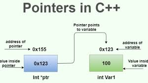

## Ponteiros

<div align="center">




</div>

<br/>

Ponteiros são uma característica fundamental da linguagem C++ que permitem a <b>manipulação direta de endereços de memória do computador</b>. Eles basicamente são "variáveis" que armazenam o endereço de outra variável. Essa capacidade de acessar e manipular a memória diretamente torna os ponteiros uma ferramenta poderosa, mas também exige um entendimento claro delas, pois existem muitos erros provenientes da má manipulação de ponteiros, como <b>vazamentos de memória, acessos inválidos ou corrupção de dados.</b>

### Principais conceitos de ponteiros

#### 1. Declaração e inicialização

Um ponteiro é declarado usando o operador ```*```. Por exemplo, ```int *ptr``` declara um ponteiro para um inteiro. Inicializar um ponteiro envolve atribuir-lhe
o endereço de uma variável usando o operador ```&```:

```cpp
int x = 10;
int *ptr = &x;  // ptr agora contém o endereço de x
```

#### 2. Aritmética de ponteiros

Ponteiros podem ser manipulados aritmeticamente para apontar para diferentes posições de memória, especialmente em arrays:

```cpp
int arr[5] = {1, 2, 3, 4, 5};
int *ptr = arr;  // ptr aponta para o primeiro elemento de arr
ptr++;           // ptr agora aponta para o segundo elemento de arr
```

#### 3. Ponteiros nulos e validação

Um ponteiro pode ser inicializado como nulo para indicar que ele não aponta para nenhum endereço válido:

```cpp
int *ptr = nullptr;  // ptr é um ponteiro nulo
```

#### 4. Ponteiros para ponteiros

É possível declarar ponteiros que apontam para outros ponteiros:

```cpp
int x = 10;
int *ptr = &x;
int **pptr = &ptr;  // pptr é um ponteiro para um ponteiro para um int
```