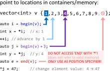

## Iteradores

<div align = "center">

</div>

<br/>

Em C++, os iteradores são ferramentas poderosas que permitem <b>percorrer e manipular elementos dentro de coleções de dados de forma eficiente e genérica</b>. Eles fornecem uma abstração uniforme para acessar elementos em diferentes tipos de contêineres, como vetores, listas, conjuntos e mapas, sem a necessidade de conhecer sua implementação interna.

### Percorrendo coleções

Os iteradores são comumente utilizados em loops for para percorrer os elementos de uma coleção:

```cpp
std::vector<int> numbers = {1, 2, 3, 4, 5};

for (std::vector<int>::iterator it = numbers.begin(); it != numbers.end(); ++it) {
  std::cout << *it << " ";
}
```

### Acessando elementos

Os iteradores podem ser desreferenciados para acessar o valor do elemento apontado:

```cpp
std::vector<int> numbers = {1, 2, 3, 4, 5};

std::vector<int>::iterator it = numbers.begin();
int primeiro_numero = *it; // primeiro_numero conterá o valor 1
```

### modificando elementos

Os iteradores podem ser usados para modificar o valor do elemento apontado:

```cpp
std::vector<int> numbers = {1, 2, 3, 4, 5};

std::vector<int>::iterator it = numbers.begin();
*it = 10; // O primeiro elemento da lista agora é 10

for (it = numbers.begin(); it != numbers.end(); ++it) {
  std::cout << *it << " ";
}
```