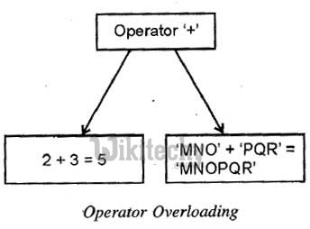

## Sobrecarga

<div align = "center">

</div>

<br/>

Em C++, a sobrecarga é um recurso poderoso que permite <b>definir múltiplas funções com o mesmo nome, mas com comportamentos distintos.</b> Isso é útil para criar código mais flexível, legível e reutilizável.

Existem dois tipos principais de sobrecarga em C++:

### Sobrecarga de funções

A sobrecarga de funções permite que você <b>defina diversas funções com o mesmo nome, desde que seus conjuntos de parâmetros sejam diferentes.</b> O compilador C++ seleciona automaticamente a função correta a ser chamada com base nos tipos e na quantidade de argumentos fornecidos:

```cpp
int soma(int a, int b);
double soma(double a, double b);

int res1 = soma(2, 3); // Chama a função soma(int, int)
double res2 = soma(2.5, 3.2); // Chama a função soma(double, double)
```

### Sobrecarga de operadores

A sobrecarga de operadores permite que você <b>redefina o comportamento de operadores existentes, como +, -, *, /, etc., para tipos de dados personalizados</b>. Isso torna seu código mais intuitivo e expressivo, pois você pode usar os operadores familiares para realizar operações específicas em seus tipos de dados:

```cpp
class Complexo {
public:
  double real;
  double imaginario;

  Complexo operator+(const Complexo& outro) {
    Complexo resultado;
    resultado.real = real + outro.real;
    resultado.imaginario = imaginario + outro.imaginario;
    return resultado;
  }
};

int main() {
  Complexo c1(2, 3);
  Complexo c2(4, 5);
  Complexo soma = c1 + c2; // Usa o operador + sobrecarregado para Complexos
  return 0;
}
```