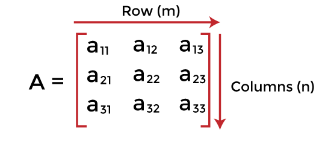
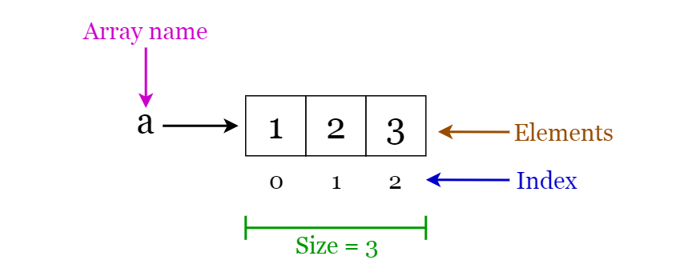
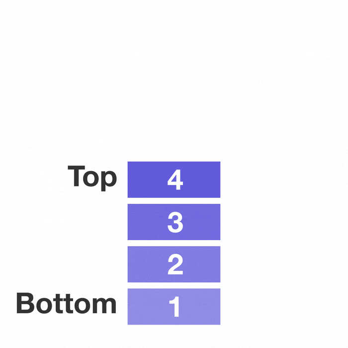
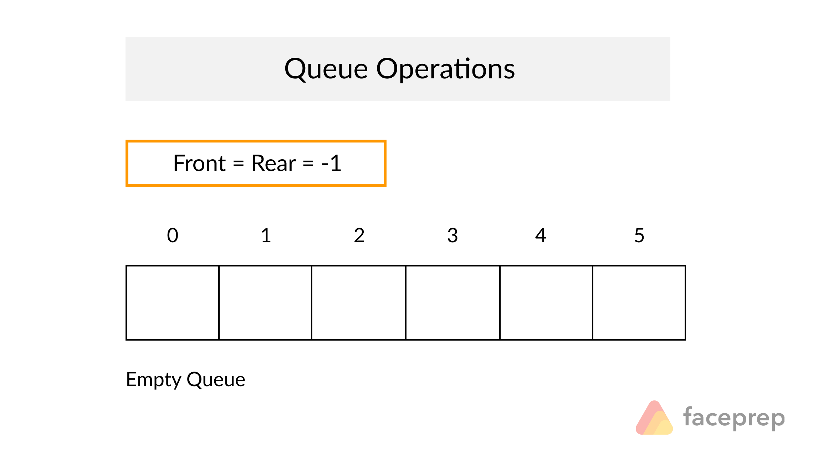

## Principais TADs em C++: Matrizes, vetores, listas, pilhas e filas

### Matrizes



Uma matriz é uma estrutura bidimensional que armazena elementos em linhas e colunas, acessíveis por meio de índices.

```c++

#include <iostream>

using namespace std;

int main() {
  int matriz[3][3] = {{1, 2, 3}, {4, 5, 6}, {7, 8, 9}};

  for (int i = 0; i < 3; i++) {
    for (int j = 0; j < 3; j++) {
      cout << matriz[i][j] << " ";
    }
    cout << endl;
  }

  return 0;
}
```

#### Custo computacional

* **Complexidade de acesso:** *O(1)* no melhor caso, *O(n)* no pior caso (para matrizes esparsas).
* **Complexidade de busca:** *O(n)*.

### Vetores



Um vetor é uma estrutura unidimensional que armazena elementos em sequência, acessíveis por meio de índices.

```c++

#include <iostream>
#include <vector>

using namespace std;

int main() {
  vector<int> vetor = {1, 2, 3, 4, 5};

  // Acessando por índice
  cout << "Elemento na posição 2: " << vetor[2] << endl;

  // Inserindo no final
  vetor.push_back(6);

  // Removendo do final
  vetor.pop_back();

  // Percorrendo o vetor
  for (int elemento : vetor) {
    cout << elemento << " ";
  }

  cout << endl;

  return 0;
}
```

#### Custo computacional

* **Complexidade de acesso:** *O(n)*.
* **Complexidade de inserção/remoção no início/fim:** *O(1)*.
* **Complexidade de inserção/remoção no meio:** *O(1)*.
* **Complexidade de busca:** *O(n)*.

### Listas dinâmicas:


Uma lista é uma estrutura linear de elementos armazenados em nós interligados, permitindo inserção, remoção e acesso eficientes.

```c++

#include <iostream>
#include <list>

using namespace std;

int main() {
  list<int> lista = {1, 2, 3, 4, 5};

  // Acessando o primeiro elemento
  cout << "Primeiro elemento: " << lista.front() << endl;

  // Acessando o último elemento
  cout << "Último elemento: " << lista.back() << endl;

  // Inserindo no início
  lista.push_front(0);

  // Removendo do início
  lista.pop_front();

  // Inserindo no final
  lista.push_back(6);

  // Removendo do final
  lista.pop_back();

  // Percorrendo a lista
  for (int elemento : lista) {
    cout << elemento << " ";
  }

  cout << endl;

  return 0;
}
```

#### Custo computacional

* **Complexidade de acesso:** *O(n)*.
* **Complexidade de inserção/remoção no início/fim:** *O(1)*.
* **Complexidade de inserção/remoção no meio:** *O(1)*.
* **Complexidade de busca:** *O(n)*.

### Pilhas



Uma pilha é uma estrutura LIFO (Last In, First Out), onde o último elemento inserido é o primeiro a ser removido.

```c++

#include <iostream>
#include <stack>

using namespace std;

int main() {
  stack<int> pilha;

  // Empilhando elementos
  pilha.push(1);
  pilha.push(2);
  pilha.push(3);

  // Acessando o topo
  cout << "Elemento no topo: " << pilha.top() << endl;

  // Desempilhando elementos
  while (!pilha.empty()) {
    cout << pilha.top() << " ";
    pilha.pop();
  }

  cout << endl;

  return 0;
}
```

#### Custo computacional

* **Empilhar/desempilhar:** *O(1)*.
* **Acessar o topo:** *O(1)*.

### Filas



Uma fila é uma estrutura FIFO (First In, First Out), onde o primeiro elemento inserido é o primeiro a ser removido.

```c++

#include <iostream>
#include <queue>

using namespace std;

int main() {
  queue<int> fila;

  // Enfileirando elementos
  fila.push(1);
  fila.push(2);
  fila.push(3);

  // Acessando o primeiro elemento
  cout << "Primeiro elemento: " << fila.front() << endl;

  // Desenfileirando elementos
  while (!fila.empty()) {
    cout << fila.front() << " ";
    fila.pop();
  }

  cout << endl;

  return 0;
}
```

#### Custo computacional

* **Adição:** *O(1)*

* **Remoção:** *O(1)*

* **Acessar o primeiro elemento:** *O(1)*

* **Verificar se a fila está vazia:** *O(1)*