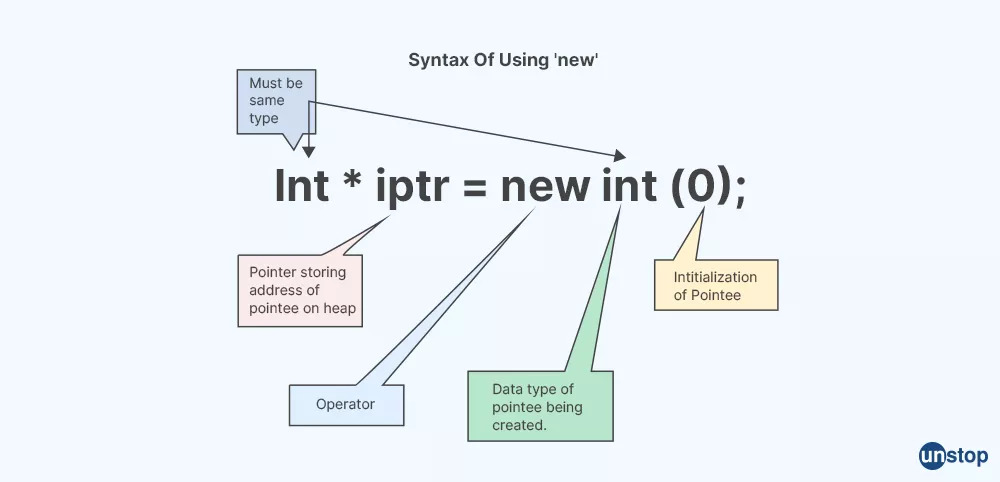

# Alocação dinâmica



A alocação dinâmica de memória em C++ é um recurso crucial que permite **gerenciar a memória de forma eficiente durante a execução do programa**. Ao contrário da alocação estática, que reserva memória em tempo de compilação com tamanho fixo, a alocação dinâmica *aloca e libera memória no heap em tempo de execução*, de acordo com as necessidades do programa.

## Alocação com new

O operador `new` é utilizado para alocar memória dinamicamente em C++. Ele retorna um ponteiro para o tipo de dado alocado, com o tamanho especificado entre parênteses:

```cpp
int* ptr = new int; // Aloca memória para um inteiro
double* new_ptr = new double[10]; // Aloca memória para um vetor de 10 doubles
```

### Desalocação com delete

É crucial liberar a memória alocada dinamicamente para evitar vazamentos de memória. O operador `delete` é utilizado para desalocar a memória apontada por um ponteiro:

```cpp
delete ptr; // Libera a memória alocada para o inteiro
delete[] new_ptr; // Libera a memória alocada para o vetor de doubles
```

### Alocação dinâmica de vetores

O C++ oferece a classe `std::vector` para gerenciar vetores de forma mais eficiente e segura. Ela encapsula a alocação e desalocação de memória, evitando vazamentos e simplificando o código:

```cpp
std::vector<int> vtr; // Cria um vetor de inteiros vazio
vtr.push_back(5); // Adiciona o valor 5 ao vetor
vtr.size(); // Retorna o tamanho do vetor (1)
```
