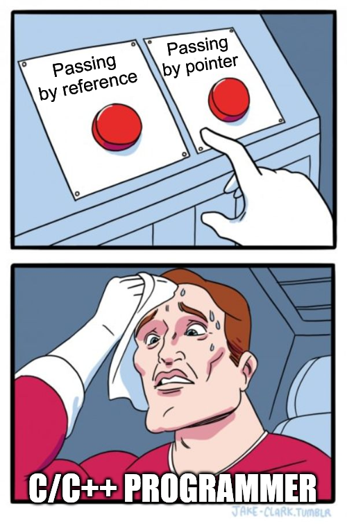

# Ponteiros vs referências

Em C++, tanto ponteiros quanto referências fornecem acesso indireto à memória e à manipulação de dados. No entanto, existem diferenças cruciais em sua natureza, funcionalidade e uso.

Ponteiros armazenam endereços de memória, permitindo acesso direto, operações complexas e gerenciamento manual, exigindo cuidado com nulidade, invalidade e vazamentos. Referências funcionam como apelidos para variáveis, oferecendo acesso indireto transparente sem operações de ponteiro, sendo sempre válidas e o gerenciamento de memória é automático.

É indicado que se escolha o uso de ponteiros quando é necessário controle total da memória e o uso de operações complexas, enquanto referências são utilizadas quando se prioriza simplicidade, legibilidade e segurança na manipulação de dados.
