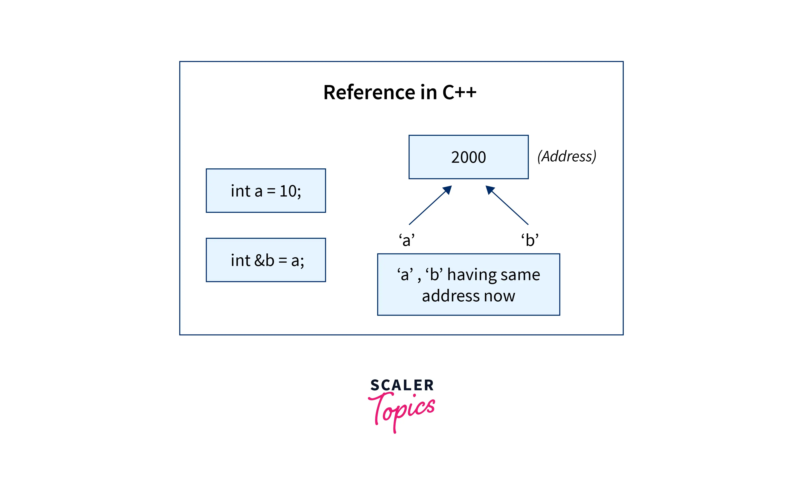

# Referência



Em C++, referências são um **tipo de variável que atua como um apelido para outra variável**. Elas são uma característica fundamental da linguagem e têm várias aplicações práticas, incluindo a melhoria da eficiência e a manipulação de dados sem cópia adicional.

## Definição e declaração

Uma referência é declarada usando o símbolo `&` após o tipo da variável:

```cpp
int a = 5;
int& ref = a; // ref é uma referência para a variável a
```

Neste exemplo, *ref* é uma referência para a variável *a*, ou seja, qualquer operação realizada em *ref* afeta diretamente *a*.
