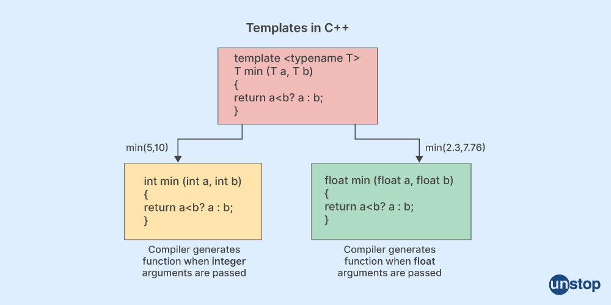

## Templates

<div align = "center">

</div>

<br/>

No C++, os templates, também conhecidos como modelos, são um recurso poderoso que permite a criação de código genérico. Isso significa que você pode <b>escrever funções e classes que podem trabalhar com diferentes tipos de dados</b> sem a necessidade de reescrever o código para cada tipo individual.

Imagine que você precisa escrever uma função para comparar dois valores. Com templates, você pode escrever uma única função ```compare()``` que pode comparar diferentes tipos de dados, simplesmente especificando o tipo de dado na instanciação:

```cpp
template <typename T>
bool compare(const T& a, const T& b) {}
```

Você pode criar classes container genéricas, como pilhas, filas ou vetores, que podem armazenar elementos de qualquer tipo de dado. A biblioteca padrão do C++ (STL) fornece diversos exemplos de containers genéricos, como vector, list e map:

```cpp
template <typename T>
class MyContainer {};
```